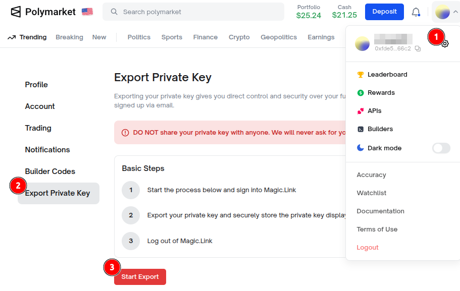
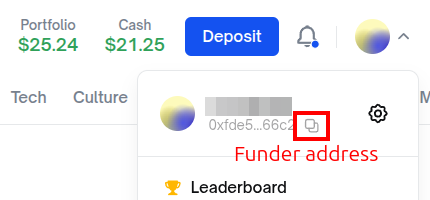

# Polymarket Simple Copy Trade

This repository contains a simple implementation of a copy trading bot for Polymarket. The bot allows users to automatically copy trades made by a specified trader on the Polymarket platform.

Only work using Email login method.

Settings are configured in the `data/config.yaml` file.

```yaml
private_key: "0xFFFFFF" # Login using Email > Settings > Export Private Key
funder_address: "0xFFFFFF" # Public address of the account

percent_sell: 50  # Profit percentage to trigger auto sell, e.g., 50 means sell when profit reaches 50%, 0 means no auto sell

traders:
  - address: "0xFFFFFF" # Trader's public address
    threshold: 50000 # If trader total position reach <threshold> USD, then trigger auto buy
    purchase_amount: 1 # Amount to purchase when threshold is reached
    slippage: 5 # Slippage tolerance in percentage, compare trader's avg price with current market before executing auto buy, e.g., 5 means 5%, 0 means no slippage check
```

### How to get Private Key



### How to get Funder Address

